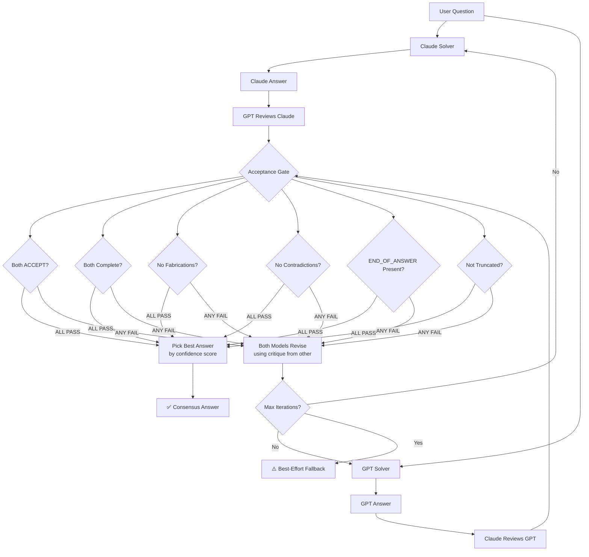

# 🤖 AI Consensus Platform

**Dual-model co-solving with symmetric cross-review.**

Two AI models (Claude + GPT) independently solve your question, then cross-review each other's answers. The system only accepts a response when both models agree it's complete, grounded, and contradiction-free.


---

## 📋 Table of Contents

- [How It Works](#-how-it-works)
- [Architecture](#-architecture)
- [Features](#-features)
- [Prerequisites](#-prerequisites)
- [Installation](#-installation)
- [Configuration](#-configuration)
- [Running the App](#-running-the-app)
- [Usage Guide](#-usage-guide)
- [Modes](#-modes)
- [File Support](#-file-support)
- [Themes](#-themes)
- [API Key Management](#-api-key-management)
- [Project Structure](#-project-structure)
- [How the Consensus Loop Works](#-how-the-consensus-loop-works)
- [Acceptance Gates](#-acceptance-gates)
- [Cost Estimation](#-cost-estimation)
- [Troubleshooting](#-troubleshooting)
- [CLI Version](#-cli-version)
- [License](#-license)

---
## 🧠 How It Works

---

## ✨ Features

- **Symmetric Co-Solving** — Both Claude and GPT solve independently, no single judge bias
- **Cross-Review** — Each model reviews the other's answer with structured JSON evaluation
- **Multi-Gate Acceptance** — Consensus requires: mutual ACCEPT + complete + no fabrications + no contradictions + no truncation
- **Fast & Robust Modes** — Quick best-of-two or full iterative consensus
- **File Upload** — PDF, DOCX, code files (30+ types) parsed server-side
- **4 Themes** — Terminal, Cyberpunk, Frost, Amber
- **Live Progress** — Real-time SSE streaming with animated spinners
- **Markdown Rendering** — Final answer rendered with full formatting
- **API Key Management** — Enter keys via UI, stored in session only
- **Retry Logic** — Exponential backoff with jitter for API overload (529/429/5xx)
- **Concurrency Control** — p-limit prevents rate limit hits
- **Mobile Responsive** — Collapsible sidebar, touch-friendly

---

## 📦 Prerequisites

- **Node.js** v18 or higher (v20+ recommended for full PDF support)
- **API Keys:**
  - [Anthropic API Key](https://console.anthropic.com/) — for Claude
  - [OpenAI API Key](https://platform.openai.com/api-keys) — for GPT

### Getting API Keys

**Claude (Anthropic):**
1. Go to [console.anthropic.com](https://console.anthropic.com/)
2. Sign up or log in
3. Navigate to **API Keys**
4. Click **Create Key**
5. Copy the key (starts with `sk-ant-...`)

**GPT (OpenAI):**
1. Go to [platform.openai.com](https://platform.openai.com/)
2. Sign up or log in
3. Navigate to **API Keys**
4. Click **Create new secret key**
5. Copy the key (starts with `sk-...`)

---

## 🚀 Installation

### Step 1: Clone / Download the project

```bash
git clone https://github.com/yourusername/ai-consensus-platform.git
cd ai-consensus-platform
```

Or create the folder manually:

```bash
mkdir ai-consensus-platform
cd ai-consensus-platform
```

### Step 2: Initialize the project

```bash
npm init -y
```

### Step 3: Install dependencies

```bash
npm install express multer axios dotenv pdf-parse@1.1.1 mammoth p-limit
```

| Package | Purpose |
|---------|---------|
| `express` | Web server + static file serving |
| `multer` | File upload handling (multipart/form-data) |
| `axios` | HTTP client for API calls |
| `dotenv` | Load environment variables from .env |
| `pdf-parse@1.1.1` | PDF text extraction (v1 for Node 18 compat) |
| `mammoth` | DOCX text extraction |
| `p-limit` | Concurrency limiter for API calls |

### Step 4: Create the project structure

```bash
mkdir -p public uploads
```

### Step 5: Add your files

Place the files in this structure:

```
ai-consensus-platform/
├── server.js              ← Main server (Express + consensus engine)
├── public/
│   ├── index.html         ← Frontend UI (HTML + JS)
│   └── styles.css         ← All themes and styles
├── uploads/               ← Temporary file upload directory (auto-cleaned)
├── package.json
├── .env                   ← (Optional) PORT and fallback API keys
└── README.md
```

### Step 6: (Optional) Create .env file

Only needed if you want to set a custom port or provide fallback API keys:

```bash
# .env (optional)
PORT=3000
```

> **Note:** API keys are entered via the web UI sidebar. You don't need them in .env.

---

## ⚙️ Configuration

All configuration is in the `CONFIG` section at the top of `server.js`:

| Variable | Default | Description |
|----------|---------|-------------|
| `PORT` | `3000` | Server port (can override via .env) |
| `CLAUDE_MAX_TOKENS` | `4000` | Max output tokens for Claude solver |
| `GPT_MAX_TOKENS` | `4000` | Max output tokens for GPT solver |
| `REVIEW_MAX_TOKENS` | `700` | Max tokens for review responses |
| `REVIEW_TEMPERATURE` | `0.2` | Low temperature for deterministic reviews |
| `MAX_ANSWER_CHARS_FOR_REVIEW` | `14000` | Truncate long answers before review |
| `MAX_FILE_CHARS` | `20000` | Max characters per uploaded file |
| `MAX_TOTAL_FILE_CHARS` | `60000` | Max total characters across all files |

### Dynamic Token Allocation

The `pickMaxTokensForSolver()` function adjusts solver tokens based on query length:

| Query Length | Max Tokens |
|-------------|------------|
| < 500 chars | 600 |
| < 3000 chars | 1500 |
| < 9000 chars | 2500 |
| 9000+ chars | 3500 |

---

## ▶️ Running the App

```bash
node server.js
```

You should see:

```
🚀 AI Consensus Platform running at http://localhost:3000
   Enter your API keys in the sidebar to get started.
```

Open [http://localhost:3000](http://localhost:3000) in your browser.

---

## 📖 Usage Guide

### 1. Enter API Keys
Open the sidebar → enter your Claude and OpenAI API keys. Keys are stored in your browser's session storage (cleared when you close the tab).

### 2. Select Mode
- **Robust** — Full consensus loop with cross-review (default, up to 5 iterations)
- **Fast** — Both models solve once, best answer picked (1 iteration, 4 API calls)

### 3. Type Your Question
Enter any question, paste code, or describe a task in the text area.

### 4. (Optional) Attach Files
Drag and drop or click to upload files. Supported types: code files, text, PDF, DOCX.

### 5. Click Execute
Watch the live progress timeline as both models solve and review. The final answer appears at the bottom with markdown formatting.

---

## 🔄 Modes

### Robust Mode (Default)
```
Iteration 1:
  Claude solves → GPT solves → Claude reviews GPT → GPT reviews Claude
  Both ACCEPT? → Consensus! Return best answer.
  Otherwise → Both revise using critique → Iteration 2...

Max 5 iterations → Fallback: return best-effort answer
```

**API calls per iteration:** 4 (minimum) + up to 4 JSON retries
**Best case:** 4 calls (consensus on first try)
**Worst case:** ~20-40 calls (5 iterations with retries)

### Fast Mode
```
Claude solves → GPT solves → Claude reviews GPT → GPT reviews Claude
→ Pick best answer based on confidence scores → Done
```

**API calls:** 4 (always)
**Use when:** Speed matters more than verification, simple questions, cost-sensitive

---

## 📁 File Support

### Supported File Types

| Category | Extensions |
|----------|-----------|
| **Code** | `.js` `.ts` `.jsx` `.tsx` `.py` `.java` `.cpp` `.c` `.h` `.go` `.rs` `.rb` `.php` `.sql` `.sh` `.bash` |
| **Web** | `.html` `.css` `.scss` `.xml` |
| **Data** | `.json` `.csv` `.yaml` `.yml` `.toml` |
| **Documents** | `.pdf` `.docx` `.txt` `.md` `.log` |

### How Files Are Processed

1. **Upload** — Multer receives files (max 10MB each, up to 10 files)
2. **Parse** — PDF via `pdf-parse`, DOCX via `mammoth`, everything else as UTF-8 text
3. **Clamp** — Each file capped at 20K characters, total capped at 60K characters
4. **Inject** — File content appended to the user query as formatted code blocks
5. **Cleanup** — Uploaded files deleted from disk immediately after parsing

### Smart File Detection

The server auto-detects when files should be included based on keywords in your query (e.g., "review", "resume", "analyze", "attached", "pdf"). You can also force inclusion with the `useFiles` parameter.

---

## 🎨 Themes

Switch themes from the sidebar. Selection persists via localStorage.

| Theme | Style | Font |
|-------|-------|------|
| **Terminal** | Green-on-black, CRT scanlines | JetBrains Mono |
| **Cyberpunk** | Neon pink/cyan on deep purple | Inter |
| **Frost** | Clean light, icy blue/white | Inter |
| **Amber** | Warm dark, amber/orange on charcoal | JetBrains Mono |

---

## 🔐 API Key Management

### How Keys Flow

```
Browser (sessionStorage)
    │
    ▼ FormData POST
Server (per-request)
    │
    ├─→ req.body.claude_key → callClaude(apiKey)
    └─→ req.body.openai_key → callGPT(apiKey)
```

### Security

- Keys stored in **sessionStorage** (cleared when tab closes)
- Keys sent via **HTTPS POST** body (not URL params)
- Server **never logs** actual key values (only `claude✓/openai✓`)
- Keys are **per-request** — not stored on the server
- No `.env` file required

---

## 📂 Project Structure

```
ai-consensus-platform/
│
├── server.js                 # Express server + consensus engine
│   ├── File parsing          # PDF, DOCX, code file extraction
│   ├── API calls             # Claude + GPT with retry & p-limit
│   ├── Prompts               # Solver, reviewer, revision prompts
│   ├── Review parsing        # JSON validation + acceptance gates
│   ├── Consensus engine      # Main loop with SSE streaming
│   └── Routes                # POST /api/consensus
│
├── public/
│   ├── index.html            # Frontend: sidebar, input, timeline, final answer
│   │   ├── Theme switcher
│   │   ├── API key inputs
│   │   ├── Mode/iteration selector
│   │   ├── File drag-and-drop
│   │   ├── SSE event handler
│   │   └── Markdown renderer
│   │
│   └── styles.css            # All 4 themes + responsive styles
│       ├── Terminal theme
│       ├── Cyberpunk theme
│       ├── Frost theme
│       ├── Amber theme
│       └── Mobile breakpoints
│
├── uploads/                  # Temp directory (auto-cleaned)
├── .env                      # Optional: PORT only
├── package.json
└── README.md
```

---

## 🔍 How the Consensus Loop Works

### Step-by-Step

1. **Both models solve** — Claude and GPT receive the same prompt with grounding rules (no fabrication, must end with `END_OF_ANSWER`)

2. **Cross-review** — Claude reviews GPT's answer, GPT reviews Claude's answer. Reviews are structured JSON:
   ```json
   {
     "decision": "ACCEPT" | "REVISE",
     "is_complete": true,
     "has_unsupported_claims": false,
     "has_contradictions": false,
     "issues": [],
     "suggestions": [],
     "confidence": 0.85
   }
   ```

3. **Acceptance gate** — Consensus requires ALL of:
   - Both reviewers say `ACCEPT`
   - Both say `is_complete: true`
   - Both say `has_unsupported_claims: false`
   - Both say `has_contradictions: false`
   - Neither answer triggers `looksTruncated()` heuristic
   - Both answers contain `END_OF_ANSWER` token

4. **If rejected** — Both models receive the critique and revise. The other model's answer is provided as reference (marked untrusted).

5. **Best answer selection** — When consensus is reached (or max iterations hit), `pickBest()` selects based on: reviewer confidence scores → fewer issues → longer answer.

---

## 🛡 Acceptance Gates

Multiple layers prevent bad answers from being accepted:

| Gate | What It Catches |
|------|----------------|
| `decision: ACCEPT` | Reviewer thinks answer is good |
| `is_complete: true` | Reviewer confirms answer isn't truncated |
| `has_unsupported_claims: false` | No fabricated metrics/dates/facts |
| `has_contradictions: false` | No self-contradictions |
| `hasEndToken()` | Model finished (didn't hit token limit) |
| `looksTruncated()` | Catches mid-sentence cutoffs, dangling connectors, unfinished sections |

### Truncation Detection

`looksTruncated()` catches:
- Endings with `:` `-` `•` `…` `...`
- Single trailing character after space (`"Ensure A"`)
- Dangling connector words (`"and"`, `"with"`, `"because"`, `"including"`, etc.)
- Unfinished markers (`"consider adding"`, `"todo"`, `"next steps"`)

---

## 💰 Cost Estimation

### Per Query (approximate)

| Mode | API Calls | Estimated Cost |
|------|-----------|---------------|
| **Fast** | 4 | ~$0.02 - $0.08 |
| **Robust (1 iter)** | 4 | ~$0.02 - $0.08 |
| **Robust (3 iter)** | 12 | ~$0.06 - $0.24 |
| **Robust (5 iter)** | 20 | ~$0.10 - $0.40 |

*Costs vary based on input/output length and current API pricing.*

### Retry Overhead
- Claude: up to 7 retries with exponential backoff (800ms base, 15s cap)
- GPT: up to 5 retries with exponential backoff
- Retries only on 429/529/5xx errors

---

## 🔧 Troubleshooting

### Common Errors

| Error | Cause | Fix |
|-------|-------|-----|
| `Missing API key(s)` | Keys not entered in sidebar | Enter both keys in the sidebar |
| `HTTP 529` | Anthropic API overloaded | Auto-retries (up to 7x). Wait and try again if persists |
| `HTTP 429` | Rate limited | Auto-retries with backoff. Reduce concurrent requests |
| `HTTP 401` | Invalid API key | Check your key is correct and has credits |
| `Unsupported file type` | File extension not in allowed list | Convert to a supported format |
| `EBADENGINE` warning on install | Node.js version too old for pdf-parse v2 | Use `pdf-parse@1.1.1` (already specified) |

### Server Won't Start

```bash
# Check Node version (need 18+)
node --version

# Reinstall dependencies
rm -rf node_modules package-lock.json
npm install

# Check if port is in use
lsof -i :3000   # macOS/Linux
netstat -ano | findstr :3000   # Windows
```

### Answers Keep Truncating

- Increase `CLAUDE_MAX_TOKENS` and `GPT_MAX_TOKENS` in server.js
- The `pickMaxTokensForSolver()` function may be setting tokens too low for your query length

### Fast Mode Still Runs Multiple Iterations

- Hard refresh browser: `Ctrl + Shift + R`
- Check server logs for `[Request] mode=fast`
- Ensure you restarted the server after code changes

---

## 💻 CLI Version

A standalone CLI version (`index.js`) is also available with the same consensus engine:

```bash
# Default: robust mode, 5 iterations
node index.js

# Fast mode: 1 iteration, best-of-two
node index.js --fast

# Custom iterations
node index.js --robust --iters=3
```

The CLI version reads API keys from `.env` and uses stdin for input (type `END` on a new line to submit).

---

## 📄 License

MIT License — free for personal and commercial use.

---
